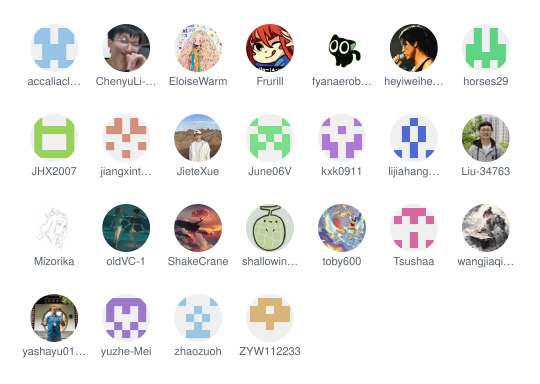

<table align="center" cellpadding="0" cellspacing="0" border="1" style="border-collapse:separate;border-spacing:0;border-radius:10px;overflow:hidden;border-color:#d0d7de;">
  <tr>
    <td align="center" bgcolor="#0969da" style="padding:8px 18px;">
      <strong>中文</strong>
    </td>
    <td align="center" bgcolor="#f6f8fa" style="padding:8px 18px;">
      <a href="./README.md" style="text-decoration:none;color:#0969da;">English</a>
    </td>
  </tr>
</table>

  <strong>欢迎来到 Beta SDC</strong>

  Beta 书院官方网页：<a href="https://westlakeu.sharepoint.com/sites/beta-college">westlakeu.sharepoint.com/sites/beta-college</a>

  <a href="https://github.com/BETA-SDC/community/tree/main/members">更多了解我们</a>

<h3 align="center">成员</h3>

  

