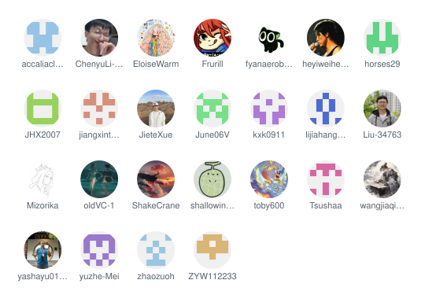

<table align="center" cellpadding="0" cellspacing="0" border="1" style="border-collapse:separate;border-spacing:0;border-radius:10px;overflow:hidden;border-color:#d0d7de;">
  <tr>
    <td align="center" bgcolor="#0969da" style="padding:8px 18px;">
      <strong>中文</strong>
    </td>
    <td align="center" bgcolor="#f6f8fa" style="padding:8px 18px;">
      <a href="./README.md" style="text-decoration:none;color:#0969da;">English</a>
    </td>
  </tr>
</table>

  <strong>欢迎来到 Beta SDC</strong>

  
  

  Beta 书院官方网页：<a href="https://westlakeu.sharepoint.com/sites/beta-college">westlakeu.sharepoint.com/sites/beta-college</a> 
  BETA 日历订阅：<a href="https://beta-sdc.github.io/calendar/">beta-sdc.github.io/calendar</a>

<h3 align="center">学生自我发展委员会（SDC）</h3>

  SDC 是 β 书院学生参与书院治理与发展的组织。SDC 成员由书院学生通过选举产生，组织由主席团和四个职能部门组成。

<ul>
  <li><strong>主席团</strong>：组织书院决策流程，代表书院对外沟通，统筹各部门工作，必要时由副主席代行主席职责。</li>
  <li><strong>综合治理部</strong>：负责学生权益、制度建设、空间管理和财务等事务。</li>
  <li><strong>文化与宣传部</strong>：建设书院文化，记录书院发展，促进多元文化融合，负责对外宣传与联络。</li>
  <li><strong>学术部</strong>：建设书院学风，组织和开展学术活动。</li>
  <li><strong>活动部</strong>：组织团队融合、体育竞赛和文艺表演等活动。</li>
</ul>

<h3 align="center">成员</h3>

  

  <a href="https://github.com/BETA-SDC/community/tree/main/members">更多了解我们</a>

